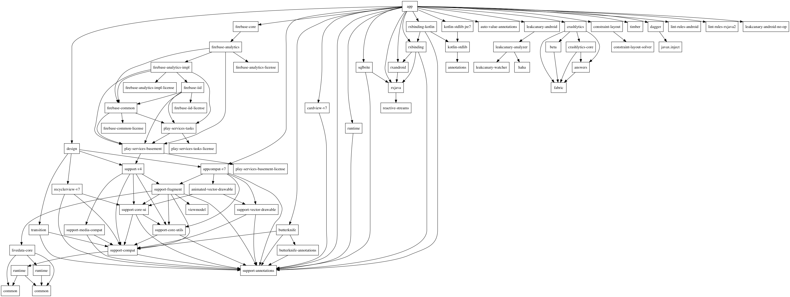
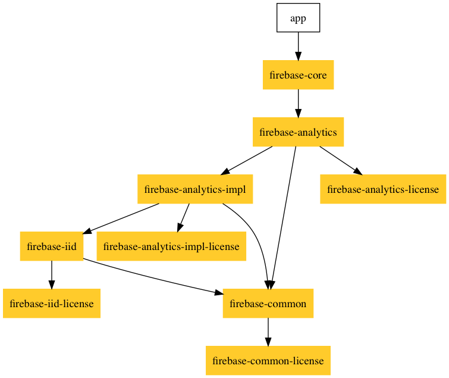

# gradle-dependency-graph-generator-plugin

Gradle plugin that lets you visualize your dependencies in a graph.

# Set up

[Gradle 3.3](https://docs.gradle.org/3.3/release-notes.html) or higher is required.

```gradle
buildscript {
  repositories {
    mavenCentral()
  }
  dependencies {
    classpath "com.vanniktech:gradle-dependency-graph-generator-plugin:0.7.0"
  }
}

apply plugin: "com.vanniktech.dependency.graph.generator"
```

Note that this plugin can be applied at the root of the project or at a specific project. Both cases will just work.

### Snapshot

```gradle
buildscript {
  repositories {
    maven { url "https://oss.sonatype.org/content/repositories/snapshots" }
  }
  dependencies {
    classpath "com.vanniktech:gradle-dependency-graph-generator-plugin:0.8.0-SNAPSHOT"
  }
}

apply plugin: "com.vanniktech.dependency.graph.generator"
```

## Usage

By default this plugin will generate a `generateDependencyGraph` task that can be used to generate a dependency graph that could look like this. This graph was generated from my [chess clock app](https://play.google.com/store/apps/details?id=com.vanniktech.chessclock).



There are extension points to be able to generate graphs which only include some dependencies and their transitive ones. The trick is to hook a [Generator](./src/main/kotlin/com/vanniktech/dependency/graph/generator/DependencyGraphGeneratorExtension.kt) in over the `dependencyGraphGenerator` extension. Note that this is extremely experimental and will likely change between releases. It's still fun though.

### Generator Example

We only want to show which Firebase libraries we're using and give them the typical Firebase orange.

```groovy
import com.vanniktech.dependency.graph.generator.DependencyGraphGeneratorPlugin
import guru.nidi.graphviz.attribute.Color
import guru.nidi.graphviz.attribute.Style

plugins.apply(DependencyGraphGeneratorPlugin)

dependencyGraphGenerator {
  generators {
    firebaseLibraries {
      include = { dependency -> dependency.getModuleGroup().startsWith("com.google.firebase") } // Only want Firebase.
      children = { dependency -> true } // Include transitive dependencies.
      dependencyNode = { node, dependency -> node.add(Style.FILLED, Color.rgb("#ffcb2b")) } // Give them some color.
    }
  }
}
```

This will generate a new task `generateDependencyGraphFirebaseLibraries` which when run will yield this graph:

The same can be done using Kotlin:

```kotlin
rootProject.plugins.apply(DependencyGraphGeneratorPlugin::class.java)
rootProject.configure<DependencyGraphGeneratorExtension> {
  generators.create("firebaseLibrarys") {
    include = { dependency -> dependency.moduleGroup.startsWith("com.google.firebase") }
    children = { true } // Include transitive dependencies.
    dependencyNode = { node, dependency -> node.add(Style.FILLED, Color.rgb("#ffcb2b")) } // Give them some color.
  }
}
```




# License

Copyright (C) 2018 Vanniktech - Niklas Baudy

Licensed under the Apache License, Version 2.0
